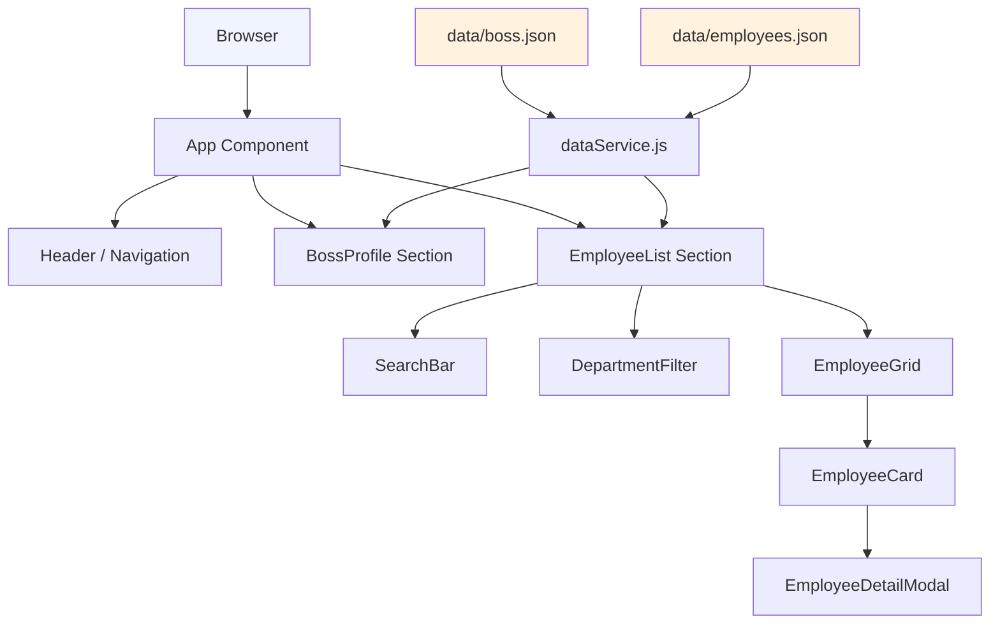
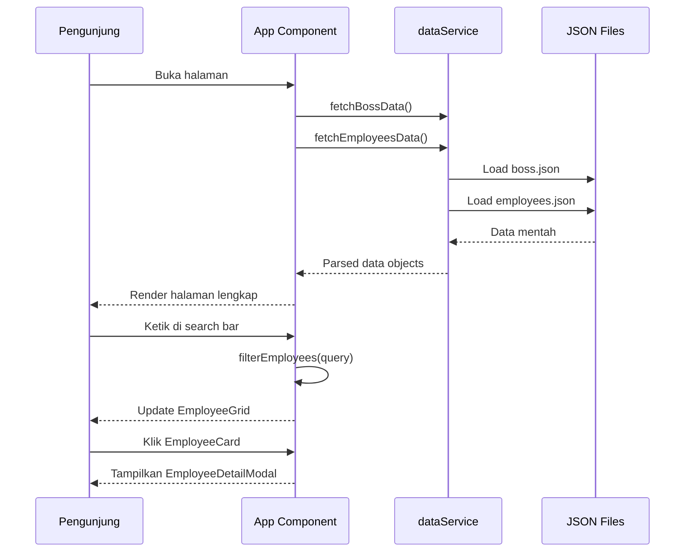

# Design Document

## Personal Company Website

---

## Overview

Website pribadi perusahaan ini adalah aplikasi web statis (atau semi-statis) yang menampilkan profil pimpinan (bos) dan daftar karyawan dengan tampilan bersih menggunakan background polos (solid color). Website dibangun sebagai Single Page Application (SPA) berbasis HTML, CSS, dan JavaScript vanilla — atau menggunakan framework ringan seperti React — dengan data karyawan yang disimpan dalam file JSON lokal atau endpoint API sederhana.

Tujuan utama website:
- Memperkenalkan pimpinan perusahaan kepada publik
- Menampilkan seluruh anggota tim secara terstruktur
- Memberikan kemampuan pencarian dan filter karyawan
- Menjaga konsistensi visual dengan background polos dan palet warna terbatas

### Keputusan Teknologi

| Aspek | Pilihan | Alasan |
|---|---|---|
| Framework | React (Vite) | Komponen reusable, ekosistem luas, mudah di-test |
| Styling | CSS Modules + CSS Variables | Scoped styles, mudah mengelola tema warna |
| Data | JSON file lokal | Sederhana, tidak butuh backend untuk MVP |
| Testing | Vitest + React Testing Library | Standar ekosistem React, mendukung PBT |
| PBT Library | fast-check | Library PBT terpopuler untuk JavaScript/TypeScript |

---

## Architecture

Website menggunakan arsitektur komponen berbasis React dengan pemisahan yang jelas antara lapisan data, logika bisnis, dan presentasi.



### Alur Data



---

## Components and Interfaces

### Struktur Komponen

```
src/
├── components/
│   ├── Header/
│   │   ├── Header.jsx
│   │   └── Header.module.css
│   ├── BossProfile/
│   │   ├── BossProfile.jsx
│   │   └── BossProfile.module.css
│   ├── EmployeeList/
│   │   ├── EmployeeList.jsx
│   │   └── EmployeeList.module.css
│   ├── EmployeeCard/
│   │   ├── EmployeeCard.jsx
│   │   └── EmployeeCard.module.css
│   ├── EmployeeDetailModal/
│   │   ├── EmployeeDetailModal.jsx
│   │   └── EmployeeDetailModal.module.css
│   ├── SearchBar/
│   │   ├── SearchBar.jsx
│   │   └── SearchBar.module.css
│   ├── DepartmentFilter/
│   │   ├── DepartmentFilter.jsx
│   │   └── DepartmentFilter.module.css
│   └── Avatar/
│       ├── Avatar.jsx
│       └── Avatar.module.css
├── services/
│   └── dataService.js
├── utils/
│   ├── filterUtils.js
│   ├── avatarUtils.js
│   └── colorUtils.js
├── data/
│   ├── boss.json
│   └── employees.json
├── styles/
│   └── theme.css
└── App.jsx
```

### Interface Komponen Utama

#### `<Header />`
```jsx
// Props: none (membaca dari theme.css)
// Menampilkan: nama perusahaan, tagline, navigasi
```

#### `<BossProfile boss={BossData} />`
```jsx
// Props:
//   boss: BossData — data pimpinan
// Menampilkan: foto/avatar, nama, jabatan, deskripsi (maks 300 karakter), kontak
```

#### `<EmployeeList employees={Employee[]} />`
```jsx
// Props:
//   employees: Employee[] — daftar karyawan
// State internal: searchQuery, selectedDepartment, showAll, selectedEmployee
// Menampilkan: SearchBar, DepartmentFilter, total count, EmployeeGrid, modal
```

#### `<EmployeeCard employee={Employee} onClick={fn} />`
```jsx
// Props:
//   employee: Employee — data karyawan
//   onClick: () => void — handler klik untuk buka detail
// Menampilkan: foto/avatar, nama, jabatan, departemen
```

#### `<EmployeeDetailModal employee={Employee | null} onClose={fn} />`
```jsx
// Props:
//   employee: Employee | null — null = modal tertutup
//   onClose: () => void — handler tutup modal
// Menampilkan: detail lengkap karyawan
```

#### `<Avatar name={string} photoUrl={string | null} size="sm"|"md"|"lg" />`
```jsx
// Props:
//   name: string — nama untuk generate inisial
//   photoUrl: string | null — URL foto, null = tampilkan inisial
//   size: "sm" | "md" | "lg" — ukuran avatar
// Menampilkan: foto jika ada, inisial jika tidak ada foto
```

### Fungsi Utilitas

#### `filterUtils.js`
```js
// filterByName(employees: Employee[], query: string): Employee[]
//   Mengembalikan karyawan yang namanya mengandung query (case-insensitive)

// filterByDepartment(employees: Employee[], dept: string): Employee[]
//   Mengembalikan karyawan dari departemen tertentu

// getUniqueDepartments(employees: Employee[]): string[]
//   Mengembalikan daftar departemen unik dari array karyawan
```

#### `avatarUtils.js`
```js
// getInitials(name: string): string
//   Mengambil inisial dari nama (maks 2 huruf)
//   Contoh: "Budi Santoso" → "BS", "Sari" → "S"
```

#### `colorUtils.js`
```js
// getContrastRatio(color1: string, color2: string): number
//   Menghitung rasio kontras antara dua warna hex
//   Menggunakan formula WCAG 2.1

// meetsWCAGAA(textColor: string, bgColor: string): boolean
//   Mengembalikan true jika rasio kontras >= 4.5
```

---

## Data Models

### `BossData`
```typescript
interface BossData {
  id: string;                    // Unique identifier
  name: string;                  // Nama lengkap
  title: string;                 // Jabatan
  description: string;           // Deskripsi singkat (maks 300 karakter)
  photoUrl: string | null;       // URL foto, null jika tidak ada
  contact: {
    email?: string;              // Alamat email (opsional)
    phone?: string;              // Nomor telepon (opsional)
    linkedin?: string;           // URL LinkedIn (opsional)
    twitter?: string;            // URL Twitter/X (opsional)
  };
}
```

### `Employee`
```typescript
interface Employee {
  id: string;                    // Unique identifier
  name: string;                  // Nama lengkap
  title: string;                 // Jabatan
  department: string;            // Departemen
  description: string;           // Deskripsi singkat
  photoUrl: string | null;       // URL foto, null jika tidak ada
  contact: {
    email?: string;
    phone?: string;
    linkedin?: string;
  };
}
```

### `ThemeConfig`
```typescript
interface ThemeConfig {
  primaryColor: string;          // Warna utama (hex)
  backgroundColor: string;       // Warna background polos (hex)
  textColor: string;             // Warna teks utama (hex)
  accentColor: string;           // Warna aksen (hex)
  fontPrimary: string;           // Font utama
  fontSecondary: string;         // Font sekunder (opsional)
}
```

### Contoh Data JSON

**`boss.json`**
```json
{
  "id": "boss-001",
  "name": "Ahmad Fauzi",
  "title": "Chief Executive Officer",
  "description": "Memimpin perusahaan dengan visi inovatif dan komitmen terhadap pertumbuhan berkelanjutan. Berpengalaman lebih dari 15 tahun di industri teknologi.",
  "photoUrl": null,
  "contact": {
    "email": "ahmad.fauzi@perusahaan.com",
    "linkedin": "https://linkedin.com/in/ahmadfauzi"
  }
}
```

**`employees.json`** (contoh)
```json
[
  {
    "id": "emp-001",
    "name": "Sari Dewi",
    "title": "Frontend Developer",
    "department": "Engineering",
    "description": "Spesialis React dan UI/UX dengan pengalaman 5 tahun.",
    "photoUrl": null,
    "contact": { "email": "sari.dewi@perusahaan.com" }
  }
]
```

---

## Correctness Properties

*A property is a characteristic or behavior that should hold true across all valid executions of a system — essentially, a formal statement about what the system should do. Properties serve as the bridge between human-readable specifications and machine-verifiable correctness guarantees.*

Fitur ini melibatkan logika filter, transformasi data (inisial avatar, truncation), dan rendering berbasis data — semua cocok untuk property-based testing menggunakan **fast-check**.

### Property Reflection

Sebelum menulis properti final, dilakukan refleksi untuk menghilangkan redundansi:

- **2.3 dan 3.3** (placeholder inisial untuk bos dan karyawan) menggunakan fungsi `getInitials()` yang sama → digabung menjadi satu properti universal.
- **3.1 dan 3.2** (setiap karyawan punya kartu, kartu menampilkan field yang benar) → digabung: untuk setiap daftar karyawan, setiap karyawan harus memiliki kartu dengan semua field yang diperlukan.
- **4.2 dan 4.4** (filter nama dan filter departemen) → keduanya adalah filter logic yang berbeda, dipertahankan sebagai properti terpisah.
- **4.3 dan 4.6** (dropdown departemen lengkap, reset pencarian) → berbeda secara semantik, dipertahankan.
- **3.5 dan 3.6** (tombol "Lihat Semua" dan total count) → berbeda, dipertahankan.
- **5.2** (detail view menampilkan semua field) → mirip dengan 3.2 tapi untuk detail view, dipertahankan.

---

### Property 1: Inisial Avatar Selalu Benar

*For any* nama (string non-kosong), fungsi `getInitials()` harus mengembalikan string yang terdiri dari huruf kapital pertama setiap kata, dengan panjang maksimal 2 karakter.

**Validates: Requirements 2.3, 3.3**

---

### Property 2: Truncation Deskripsi Bos

*For any* string deskripsi, teks yang ditampilkan pada tampilan default harus memiliki panjang maksimal 300 karakter.

**Validates: Requirements 2.5**

---

### Property 3: Kartu Karyawan Lengkap

*For any* daftar karyawan dengan N anggota, seksi Daftar_Karyawan harus merender tepat N kartu, dan setiap kartu harus menampilkan nama, jabatan, dan departemen karyawan yang bersangkutan.

**Validates: Requirements 3.1, 3.2**

---

### Property 4: Tombol "Lihat Semua" Sesuai Threshold

*For any* daftar karyawan, tombol "Lihat Semua" harus muncul jika dan hanya jika jumlah karyawan melebihi 12.

**Validates: Requirements 3.5**

---

### Property 5: Total Karyawan Akurat

*For any* daftar karyawan dengan N anggota, angka total yang ditampilkan di bagian atas seksi Daftar_Karyawan harus sama dengan N.

**Validates: Requirements 3.6**

---

### Property 6: Filter Nama Hanya Menampilkan Hasil yang Cocok

*For any* daftar karyawan dan *any* query pencarian (string), semua kartu yang ditampilkan setelah filter harus berasal dari karyawan yang namanya mengandung query tersebut (case-insensitive), dan tidak ada karyawan yang cocok yang tersembunyi.

**Validates: Requirements 4.2**

---

### Property 7: Dropdown Departemen Mencakup Semua Departemen

*For any* daftar karyawan, opsi yang tersedia di dropdown filter departemen harus sama persis dengan himpunan departemen unik yang ada dalam daftar karyawan tersebut.

**Validates: Requirements 4.3**

---

### Property 8: Filter Departemen Hanya Menampilkan Departemen yang Dipilih

*For any* daftar karyawan dan *any* pilihan departemen yang valid, semua kartu yang ditampilkan harus berasal dari karyawan yang departemennya sama dengan departemen yang dipilih.

**Validates: Requirements 4.4**

---

### Property 9: Reset Pencarian Mengembalikan Semua Karyawan

*For any* daftar karyawan, setelah melakukan pencarian apapun kemudian mengosongkan kolom pencarian, seluruh karyawan harus kembali ditampilkan (jumlah kartu = jumlah total karyawan).

**Validates: Requirements 4.6**

---

### Property 10: Detail Karyawan Menampilkan Semua Field

*For any* objek karyawan dengan data valid, tampilan detail harus menampilkan nama lengkap, jabatan, departemen, deskripsi, dan minimal satu informasi kontak.

**Validates: Requirements 5.2**

---

### Property 11: Rasio Kontras Warna Memenuhi WCAG AA

*For any* pasangan warna teks dan background yang digunakan di website, rasio kontras yang dihitung oleh fungsi `getContrastRatio()` harus bernilai ≥ 4.5.

**Validates: Requirements 6.5**

---

## Error Handling

### Skenario Error dan Penanganannya

| Skenario | Penanganan |
|---|---|
| Foto bos/karyawan tidak tersedia (`photoUrl: null`) | Tampilkan komponen `<Avatar>` dengan inisial nama |
| Foto gagal dimuat (URL rusak) | `onError` handler pada `` → fallback ke `<Avatar>` |
| Data karyawan gagal dimuat (fetch error) | Tampilkan pesan "Data tidak dapat dimuat, silakan coba lagi" |
| Pencarian tidak menemukan hasil | Tampilkan pesan "Karyawan tidak ditemukan" |
| Deskripsi melebihi 300 karakter | Truncate otomatis dengan ellipsis (`...`) |
| Nama kosong untuk inisial | Tampilkan ikon default (user icon) |

### Error Boundary

Komponen `<EmployeeList>` dan `<BossProfile>` dibungkus dengan React Error Boundary untuk mencegah crash seluruh halaman jika satu seksi gagal render.

```jsx
// Contoh penggunaan
<ErrorBoundary fallback={<ErrorMessage />}>
  <EmployeeList employees={employees} />
</ErrorBoundary>
```

---

## Testing Strategy

### Pendekatan Dual Testing

Testing menggunakan dua pendekatan komplementer:

1. **Unit Tests** (Vitest + React Testing Library): Verifikasi contoh spesifik, edge case, dan kondisi error
2. **Property-Based Tests** (Vitest + fast-check): Verifikasi properti universal di seluruh input yang mungkin

### Unit Tests

Fokus pada:
- Rendering komponen dengan data spesifik
- Interaksi UI (klik kartu → buka modal, tutup modal → kembali ke posisi scroll)
- Edge case: foto tidak ada, deskripsi kosong, daftar karyawan kosong
- Error state: data gagal dimuat, URL foto rusak

Contoh test cases:
```
- Header menampilkan nama perusahaan dan tagline
- Navigasi memiliki tautan ke #boss-profile dan #employee-list
- BossProfile menampilkan semua field yang diperlukan
- EmployeeCard menampilkan nama, jabatan, departemen
- Modal terbuka saat EmployeeCard diklik
- Modal tertutup saat tombol close diklik
- Pesan "Karyawan tidak ditemukan" muncul saat pencarian kosong
- Pesan error muncul saat data gagal dimuat
```

### Property-Based Tests

Library: **fast-check** (minimum 100 iterasi per properti)

Setiap property test harus diberi tag komentar:
```
// Feature: personal-company-website, Property {N}: {deskripsi properti}
```

| Property | Fungsi yang Ditest | Generator Input |
|---|---|---|
| P1: Inisial Avatar | `getInitials(name)` | `fc.string()` (non-empty) |
| P2: Truncation Deskripsi | `truncateDescription(text, 300)` | `fc.string()` |
| P3: Kartu Karyawan Lengkap | `<EmployeeList>` render | `fc.array(employeeArb)` |
| P4: Tombol "Lihat Semua" | `<EmployeeList>` render | `fc.array(employeeArb)` |
| P5: Total Karyawan Akurat | `<EmployeeList>` render | `fc.array(employeeArb)` |
| P6: Filter Nama | `filterByName()` | `fc.array(employeeArb)`, `fc.string()` |
| P7: Dropdown Departemen | `getUniqueDepartments()` | `fc.array(employeeArb)` |
| P8: Filter Departemen | `filterByDepartment()` | `fc.array(employeeArb)`, `fc.string()` |
| P9: Reset Pencarian | `filterByName(employees, "")` | `fc.array(employeeArb)`, `fc.string()` |
| P10: Detail Karyawan | `<EmployeeDetailModal>` render | `employeeArb` |
| P11: Kontras Warna | `getContrastRatio()` | Pasangan warna dari tema |

### Konfigurasi fast-check

```js
// vitest.config.js — konfigurasi jumlah iterasi
import { defineConfig } from 'vitest/config'

export default defineConfig({
  test: {
    // fast-check default: 100 runs per property
  }
})

// Dalam test file:
fc.assert(fc.property(...), { numRuns: 100 })
```

### Responsiveness Tests

Menggunakan `@testing-library/user-event` dan jsdom viewport simulation:
- Desktop: 1280px × 800px
- Tablet: 768px × 1024px
- Mobile: 375px × 667px
